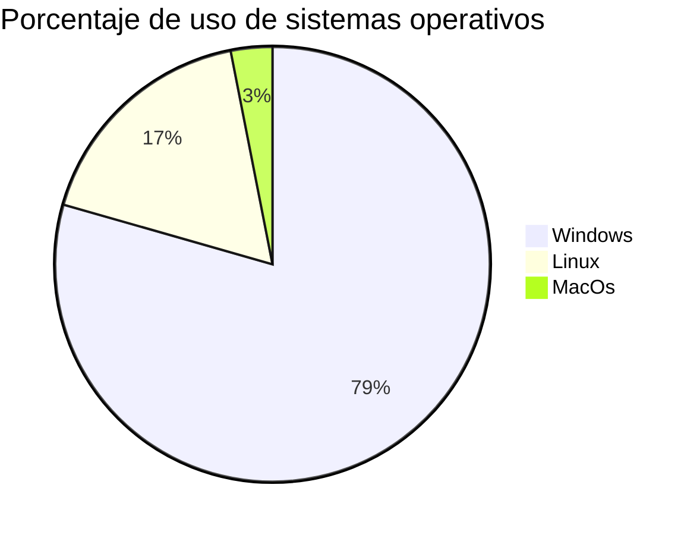

# Tema 1.1: Introducción a los sistemas operativos

Los **sistemas operativos (SO)** son el software fundamental que permite la interacción entre el usuario y el hardware del ordenador.  
Su función principal es **gestionar los recursos** del sistema (CPU, memoria, almacenamiento, periféricos, etc.) y proporcionar una **interfaz de usuario**.

---

## Clasificación de los sistemas operativos
!!! abstract "Por el número de usuarios"
    - **Monousuario**: sólo permite un usuario activo (ej. MS-DOS).  
    - **Multiusuario**: permite múltiples sesiones simultáneas (ej. Linux, UNIX).

!!! example "Por el número de tareas"
    - **Monotarea**: ejecuta una tarea a la vez.  
    - **Multitarea**: puede ejecutar varias tareas concurrentemente.

!!! note "Por su interfaz"
    - **CLI**: interfaz de línea de comandos (Command Line Interface).  
    - **GUI**: interfaz gráfica (Graphical User Interface).

---

## Componentes principales
1. **Kernel**: núcleo que gestiona los recursos del sistema.  
2. **Gestor de archivos**: controla la lectura y escritura en disco.  
3. **Intérprete de comandos**: permite ejecutar órdenes.  
4. **Drivers**: controladores de hardware.  
5. **Servicios del sistema**: procesos que se ejecutan en segundo plano.

---

!!! type "example"
A continuación un ejemplo práctico.

## Ejemplo práctico

# Comandos básicos de gestión del sistema
uname -a         # Muestra información del sistema operativo
lsb_release -a   # Muestra la versión de la distribución Linux
df -h            # Muestra el uso de disco en formato legible

